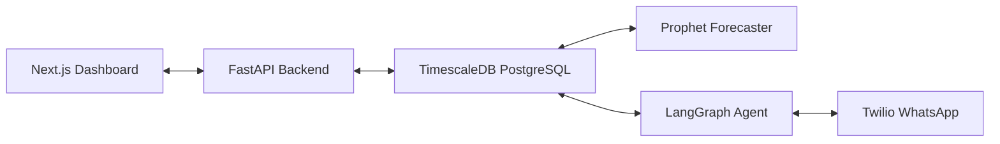

<!-- ╔══════════════════════════════════════════════════════════════════╗
     ║          PreFill — README                                        ║
     ║          The household AI that knows your kitchen better...     ║
     ╚══════════════════════════════════════════════════════════════════╝ -->

<div align="center">

  # PreFill

  ### *The household AI that knows your kitchen better than you do.*

  <br/>

  
  
  
  
  

  <br/>

  <a href="#-about-the-project">About</a> &nbsp;·&nbsp;
  <a href="#-features">Features</a> &nbsp;·&nbsp;
  <a href="#-tech-stack">Tech Stack</a> &nbsp;·&nbsp;
  <a href="#-quickstart">Quickstart</a> &nbsp;·&nbsp;
  <a href="#-contributing">Contributing</a> &nbsp;·&nbsp;
  <a href="#-author">Author</a>

</div>

---

## 📌 About the Project

**Instamart Intelligence** is a **full-stack AI application** built with **FastAPI, Next.js, Facebook Prophet, TimescaleDB, pgvector, Twilio, and LangGraph**.

Instamart Intelligence watches how your household consumes groceries over time, learning your patterns (such as milk, atta, oil, and egg consumption rate changes) using Prophet forecasting models. It proactively notifies you over WhatsApp 2 days before items deplete, letting you restock via a stateful LangGraph agent in one tap. It also features price tracking and recipe-to-cart pantry intelligence.

> **Why this project?**
> Swiggy Instamart's ultimate switching-cost moat against Blinkit by building a sticky, household-specific intelligence profile.

<br/>

---

## ✨ Features

| Status | Feature | Description |
|:---:|---|---|
| ✅ | **Time-Series Consumption Modeling** | Uses Facebook Prophet to build per-item consumption baselines, calculating average daily usage, cycle days, and depletion countdowns. |
| ✅ | **Predictive Restock WhatsApp Bot** | Triggers stateful LangGraph dialogues via Twilio WhatsApp API, allowing users to build carts and checkout in one tap. |
| ✅ | **Pantry-Aware Recipe Planner** | Extracts ingredients from user recipe queries, checks estimated remaining pantry quantities, and bundles only missing items into the cart. |
| ✅ | **Commodity Price Intelligence** | Tracks tomatoes, onions, oil, atta, and milk in a TimescaleDB hypertable, alerting users on spikes/dips and offering substitutions. |
| ✅ | **Lifestyle Anomaly Filtering** | Automatically filters out outlier events like travel gaps (predictions paused) and guest spikes so forecasting stays highly accurate. |
| ✅ | **Interactive Demo Scenario Switcher** | Collapsible control panel lets reviewers hot-swap between Standard Staples, Weekend Party, and Vacation Mode scenarios — regenerates seed data and rebuilds Prophet models on the fly. |
| ✅ | **WhatsApp Chat Sandbox Drawer** | Floating in-browser chat widget simulates the full multi-turn restock conversation (stock check → cart build → CONFIRM order) without needing a real phone. |

<br/>

---

## 🛠️ Tech Stack

<div align="center">

### Core


### Infrastructure


</div>

<br/>

| Layer | Technology | Purpose |
|---|---|---|
| **Language** | Python / TypeScript | Python for ML models & backends; TypeScript for responsive dashboards |
| **Framework** | FastAPI & Next.js 15 | Robust backend API and stateful agents; React server component page layouts |
| **Styling** | Tailwind CSS v4 | Utility-first premium design system with dark mode and micro-animations |
| **ML / Agents** | Facebook Prophet & LangGraph | Time-series consumption forecasting & stateful multi-turn restock agent |
| **LLM** | Groq API / NVIDIA NIM | Recipe ingredient extraction and natural language message generation |
| **Deployment** | Vercel & Docker | Containerized PostgreSQL/TimescaleDB and server deployments |

<br/>

---

## 🏗️ Architecture



<br/>

---

## 📁 Project Structure

```
PreFill/
│
├── docker-compose.yml              # Orchestrates the PostgreSQL with TimescaleDB container
├── pyrightconfig.json              # Configures local Python virtual environment for development tools
├── requirements.txt                # Python backend dependencies (FastAPI, Prophet, LangGraph, etc.)
├── AUDIT.md                        # Production readiness audit — 100/100 score
├── CONTEXT.md                      # Domain glossary and architecture vocabulary
│
├── backend/                        # FastAPI Web Server, ML Models, and Database Modules
│   ├── main.py                     # Entry point: lifespan, middleware (CORS, GZip), router registration
│   ├── config.py                   # Pydantic Settings — DATABASE_URL, Twilio, Groq, NVIDIA keys
│   ├── active_scenario.json        # Persists active demo scenario across restarts
│   ├── database/                   # Async engine, SQLAlchemy ORM models, Alembic migrations
│   ├── ml/                         # Prophet forecasting, anomaly detection, household profiling, confidence scorer
│   ├── agents/                     # LangGraph agents (Restock, Recipe, Price)
│   ├── services/
│   │   └── sync_service.py         # fetch_and_sync_orders() — MCP → DB with batch dedup
│   ├── api/routes/
│   │   ├── household.py            # Profile, sync, rebuild-models, scenario switcher
│   │   ├── predictions.py          # Consumption model predictions with urgency status
│   │   ├── restock.py              # Depletion check, alert history (≤45% stock, ≤7 days)
│   │   ├── recipes.py              # Recipe list, parse, and pin endpoints
│   │   ├── prices.py               # Commodity price feed and spike/dip alerts
│   │   └── orders.py               # Raw order history from seed JSON
│   ├── notifications/
│   │   ├── whatsapp.py             # Webhook handler (Twilio + JSON sandbox) + LangGraph runner
│   │   └── scheduler.py            # APScheduler: 07:00 prices, 08:00 depletions, 02:00 Sun rebuild
│   ├── mcp/
│   │   ├── client.py               # SwiggyMCPClient wrapper
│   │   └── mock_server.py          # Localhost mock MCP server (port 8001)
│   ├── seed/
│   │   ├── catalog.py              # 13-item CATALOG + format_restock_alert_message()
│   │   ├── generate_orders.py      # Standard order history generator
│   │   ├── scenarios.py            # Deterministic scenario generator (standard/party/vacation)
│   │   ├── seed_prices.py          # Backfills 30-day price history into TimescaleDB
│   │   └── generated_orders.json   # Active seed data (auto-regenerated on scenario switch)
│   └── tests/                      # 16 tests — async SQLite in-memory, no Docker required
│
├── frontend/                       # Next.js 15 Dashboard
│   ├── app/
│   │   ├── page.tsx                # Dashboard — Virtual Pantry Shelf + Depletion Timeline + Scenario Panel
│   │   ├── predictions/page.tsx    # Full prediction list with SWR caching
│   │   ├── recipes/page.tsx        # Recipe planner — parse and pin
│   │   ├── price-alerts/page.tsx   # Price intelligence — sparkline charts and signals
│   │   └── household/page.tsx      # Household profile
│   ├── components/
│   │   ├── ChatDrawer.tsx          # WhatsApp Sandbox Simulator — floating chat with suggestion chips
│   │   └── Header.tsx              # Navigation header
│   └── lib/api.ts                  # Axios client + TypeScript interfaces for all API responses
│
├── docs/                           # Specs, ADRs, Builders Club application
└── README.md
```

<br/>

---

## ⚡ Performance Optimizations

To keep the application highly responsive, low-latency, and production-ready, several systematic optimizations are implemented:

* **Asynchronous Thread Offloading**: Heavy time-series model fitting (Facebook Prophet) is offloaded to background threads using `asyncio.to_thread` to ensure FastAPI's event loop is never blocked by CPU-bound tasks.
* **GZip Payload Compression**: Backed by FastAPI's `GZipMiddleware` to compress API payloads, significantly saving network bandwidth and speeding up client load times.
* **Smart Client Caching (SWR)**: Utilizes Next.js `swr` for data fetching. Implements cache-first loading, deduplication of concurrent requests, and silent revalidation to deliver instantaneous tab transitions (<10ms).
* **Indexed Database Schemas**: Added database index annotations on all primary foreign key joins (`household_id`, `order_id`, `item_id`) in PostgreSQL/TimescaleDB to ensure rapid query execution as order history scales.
* **GPU-Accelerated Animations**: Configured `will-change` CSS properties for smooth, hardware-accelerated transitions on interactive elements.

<br/>

---

## 🚀 Quickstart

### Prerequisites

- **Docker** — Required to run the containerized TimescaleDB time-series database
- **Python 3.12 & Node.js 18+** — Needed for running backend APIs and compiling the Next.js React frontend

<br/>

### Step 1 — Clone

```bash
git clone https://github.com/kwakhare5/PreFill.git
cd PreFill
```

### Step 2 — Seed Precision Data

Generate order histories and backfill prices in PostgreSQL/TimescaleDB:

```bash
python -m backend.seed.generate_orders
python -m backend.seed.seed_prices
```

### Step 3 — Start Servers

Launch the mock Instamart MCP catalog server, the primary backend server, and the Next.js dashboard:

```bash
# Terminal 1
python -m uvicorn backend.mcp.mock_server:app --port 8001

# Terminal 2
python -m uvicorn backend.main:app --port 8000

# Terminal 3
cd frontend && npm run dev
```

<br/>

---

## 🤝 Contributing

1. **Fork** the repository
2. **Create** your feature branch (`git checkout -b feature/your-feature`)
3. **Commit** using [Conventional Commits](https://www.conventionalcommits.org/) (`git commit -m "feat: add your feature"`)
4. **Push** (`git push origin feature/your-feature`)
5. **Open a Pull Request**

<br/>

---

## 🛡️ Privacy & Trust Statement

> All data ingestion, model fitting, and profiling remain completely within the user-authorized account scope. Travel patterns, guest spikes, and dietary fluctuations are flagged locally to secure baseline forecasting and are never sold or utilized for third-party marketing purposes.

<br/>

---

## 📄 License

Distributed under the **MIT License**. See `LICENSE` for the full text.

<br/>

---

## 👨‍💻 Author

<div align="center">

### Karan Wakhare
*Full Stack Engineer*

<br/>

[](https://www.linkedin.com/in/karanwakhare)
[](https://x.com/kwakhare5)
[](mailto:kwakhare5@gmail.com)
[](https://github.com/kwakhare5)

<br/>


<br/>


</div>

<br/>

---

<div align="center">

  Made with ❤️ by [Karan Wakhare](https://github.com/kwakhare5)

  <br/>

  *"The best way to predict the future is to build it."*

  <br/>

  

</div>
