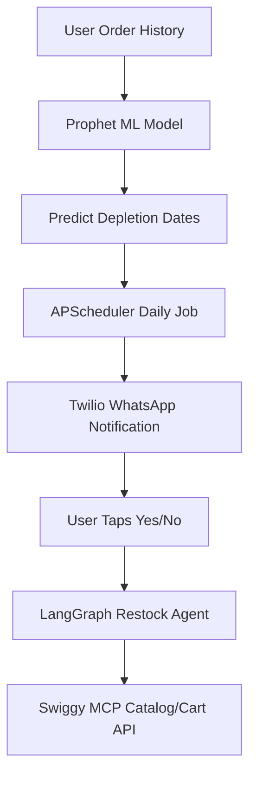

# SHIPPING_PLAYBOOK.md — The PreFill Shipping Playbook

This document serves as the master checklist and guide for deploying **PreFill** to production, configuring all necessary environments, and executing outreach to leaders in the Indian Quick Commerce market.

---

## 🛠️ SECTION 1: INFRASTRUCTURE DEPLOYMENT GUIDE

### 1.1 Railway Deployment (Backend + PostgreSQL)

Railway handles the FastAPI application, APScheduler background jobs, and PostgreSQL database.

#### Step 1: Initialize Database & App Services
1. Go to [Railway.app](https://railway.app) and sign in.
2. Click **New Project** → **Provision PostgreSQL**. This spins up a dedicated Postgres database instance.
3. Click **New** → **Github Repo** → Select `kwakhare5/PreFill`.
4. Click on the newly added backend service, go to **Settings**, and under **Build & Deploy**:
   - Set **Build Command** to `pip install -r requirements.txt`
   - Set **Start Command** to `uvicorn backend.main:app --host 0.0.0.0 --port $PORT` (Railway injects the `$PORT` automatically).

#### Step 2: Environment Variables Configuration
Navigate to the **Variables** tab of your FastAPI service and add the following keys:

| Variable Name | Value / Format | Purpose |
|---|---|---|
| `DATABASE_URL` | `postgresql+asyncpg://...` | DB connection string (use reference from the provisioning step, e.g. `${{ Postgres.DATABASE_URL }}` but replace driver from `postgresql://` to `postgresql+asyncpg://`) |
| `MCP_BASE_URL` | `https://prefill-mock-mcp.railway.app` | The production URL of the mock/live Swiggy MCP server |
| `GROQ_API_KEY` | `gsk_...` | Groq API Key (for LLM Restock parsing) |
| `NVIDIA_API_KEY` | `nvapi-...` | NVIDIA API Key (fallback or alternate agent models) |
| `TWILIO_ACCOUNT_SID` | `AC...` | Twilio API credential for WhatsApp |
| `TWILIO_AUTH_TOKEN` | `[Token]` | Twilio API authentication token |
| `TWILIO_WHATSAPP_FROM` | `whatsapp:+14155238886` | Twilio sandbox or verified sender number |
| `ALLOWED_ORIGINS` | `https://prefill.vercel.app` | Vercel production frontend URL (handles CORS) |

---

### 1.2 Vercel Deployment (Frontend)

Vercel hosts the Next.js 15 application.

#### Step 1: Connect Repo
1. Go to [Vercel](https://vercel.com) and sign in.
2. Click **Add New** → **Project** → Import the `kwakhare5/PreFill` repository.
3. In the project setup, set the **Root Directory** to `frontend`.

#### Step 2: Environment Variables Configuration
In the **Environment Variables** section of Vercel, add:

| Variable Name | Value | Purpose |
|---|---|---|
| `NEXT_PUBLIC_API_URL` | `https://prefill-backend.railway.app` | Production URL of the Railway backend API |

#### Step 3: Deploy
- Click **Deploy**. Vercel will build the frontend and provide a live URL (e.g., `https://prefill.vercel.app`).

---

### 1.3 Twilio Sandbox Configuration
1. Log in to [Twilio Console](https://console.twilio.com).
2. Go to **Messaging** → **Try it out** → **Send a WhatsApp message**.
3. Follow the steps to connect your personal phone to the sandbox (e.g., sending `join <code-here>`).
4. Set the **Sandbox Webhook** URL for incoming messages to your Railway endpoint:
   ```
   https://prefill-backend.railway.app/api/webhook/whatsapp
   ```

---

## 📈 SECTION 2: INDIAN QUICK COMMERCE OUTREACH DATA

To get recognition, DMs must be highly targeted. Below is the updated and verified list of Q-commerce leaders, including Swiggy Instamart.

### 2.1 Swiggy Instamart

| Name | Role | X (Twitter) | LinkedIn | Focus |
|---|---|---|---|---|
| **Sriharsha Majety** | Co-founder & Group CEO | [@harshamajety](https://x.com/harshamajety) | [sriharshamajety](https://www.linkedin.com/in/sriharshamajety/) | Long-term strategy, new initiatives |
| **Phani Kishan Addepalli** | Co-founder & Head of Growth | [@phani_kishan](https://x.com/phani_kishan) | [phanikishan](https://www.linkedin.com/in/phanikishan/) | Growth engineering, consumer habit loops |
| **Amitesh Jha** | CEO of Swiggy Instamart | N/A | [amitesh-jha-9214732](https://www.linkedin.com/in/amitesh-jha-9214732/) | Instamart business unit, operations, and scale |
| **Madhusudhan Rao** | Group CTO | N/A | [madhusudhanrao](https://www.linkedin.com/in/madhusudhanrao/) | Tech infrastructure, AI & search implementation |

### 2.2 Blinkit

| Name | Role | X (Twitter) | LinkedIn | Focus |
|---|---|---|---|---|
| **Albinder Dhindsa** | Co-founder & CEO | [@albinder](https://x.com/albinder) | [adhindsa](https://www.linkedin.com/in/adhindsa/) | Product vision, dark store networks, unit economics |
| **Saurabh Kumar** | Founder Member | N/A | [saurabh-kumar-773a4b](https://www.linkedin.com/in/saurabh-kumar-773a4b/) | Core growth strategy and retention |

### 2.3 Zepto

| Name | Role | X (Twitter) | LinkedIn | Focus |
|---|---|---|---|---|
| **Aadit Palicha** | Co-founder & CEO | [@aadit_palicha](https://x.com/aadit_palicha) | [aadit-palicha](https://www.linkedin.com/in/aadit-palicha/) | Fast scaling, capital allocation, public narrative |
| **Kaivalya Vohra** | Co-founder & CTO | [@kaivalya_v](https://x.com/kaivalya_v) | [kaivalya-vohra](https://www.linkedin.com/in/kaivalya-vohra/) | System scale, routing engines, app performance |

---

## 📨 SECTION 3: OUTREACH SCRIPTS & TEMPLATES

### 3.1 LinkedIn DM Template (For PMs & Directors)
> **Subject:** PreFill — A Working consumer-side AI grocery assistant
>
> "Hi [Name] — I'm a developer and I built a working prototype of something I think [Zepto/Blinkit/Instamart] doesn't have yet: an AI layer that proactively WhatsApps users before they run out of groceries, based on their consumption patterns. 1-tap reorder.
> 
> Live demo: [https://prefill.vercel.app]
> Demo video: [Loom Link]
> 
> Would love 15 minutes of your time or any feedback on my implementation."

### 3.2 Twitter/X DM Template (For CEOs: Aadit / Albinder / Sriharsha)
> "Built a consumer-side AI grocery assistant called PreFill. Proactive WhatsApp nudge before users run out + 1-tap reorder.
> 
> Working demo: [https://prefill.vercel.app]
> Loom: [Loom Link]
> 
> Would love your take on the predictive replenishment approach."

---

## 📝 SECTION 4: GITHUB README TEMPLATE

Copy this template into your root `README.md` to present the project professionally.

```markdown
# PreFill 🛒 — Household Grocery Intelligence

> An AI assistant that watches household consumption, predicts depletion dates, and proactively WhatsApps you to reorder in 1-tap.

[](https://prefill.vercel.app)
[](https://loom.com/...)

## 💡 The Core Problem

Quick commerce platforms (Blinkit, Zepto, Swiggy Instamart) compete fiercely on speed. However, speed is no longer a differentiator. The next battle is **intelligence**. 

Today, platforms are reactive—waiting for you to open the app. PreFill is proactive. It lives where you are (WhatsApp) and replenishes your household before you run out.

## 🛠️ Architecture & Tech Stack

- **Frontend**: Next.js 15 (App Router), Tailwind CSS v4, SWR, Lucide Icons.
- **Backend**: FastAPI, SQLAlchemy (Async), PostgreSQL (TimescaleDB ready).
- **ML Engine**: Facebook Prophet for time-series grocery consumption forecasting.
- **AI Agents**: LangGraph for multi-turn restock conversational flows.
- **Delivery**: Twilio API for WhatsApp notification delivery.



## 🚀 Running Locally

### Prerequisites
- Python 3.12+
- Node.js 18+

### Setup

1. **Clone the Repo**
   ```bash
   git clone https://github.com/kwakhare5/PreFill.git
   cd PreFill
   ```

2. **Backend Setup**
   ```bash
   python -m venv venv
   source venv/bin/activate  # venv\Scripts\activate on Windows
   pip install -r requirements.txt
   ```

3. **Frontend Setup**
   ```bash
   cd frontend
   npm install
   ```

4. **Run Development Server**
   ```bash
   # From root directory
   npm run dev
   ```

## 📄 License

Distributed under the MIT License. See `LICENSE` for more information.
```
