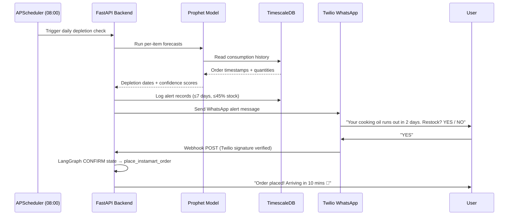

# Swiggy Builders Club — Application

**To:** Swiggy Builders Club Selection Committee  
**From:** Karan Wakhare  
**Subject:** PreFill — The Household AI That Builds a Moat Across Q-Commerce  
**Contact:** kwakhare5@gmail.com  
**GitHub:** https://github.com/kwakhare5/PreFill  
**Date:** June 2026

---

## 1. Who I Am

I am **Karan Wakhare**, an individual full-stack engineer with a strong focus on AI systems, time-series ML, and agentic product design. I have built PreFill end-to-end as an independent prototype — from the PostgreSQL/TimescaleDB schema design to the Facebook Prophet forecasting models, the LangGraph multi-turn WhatsApp agent, and the Next.js 15 dashboard.

| Field | Details |
|---|---|
| **Name** | Karan Wakhare |
| **Role** | Individual Developer (Solo Prototype) |
| **Email** | kwakhare5@gmail.com |
| **GitHub** | [@kwakhare5](https://github.com/kwakhare5) |
| **LinkedIn** | [karanwakhare](https://www.linkedin.com/in/karanwakhare) |
| **Twitter / X** | [@kwakhare5](https://x.com/kwakhare5) |
| **Project Repo** | [PreFill](https://github.com/kwakhare5/PreFill) |
| **Type** | Individual Developer |

---

## 2. What I'm Building

### Problem Statement

In the hyper-competitive quick commerce landscape, Swiggy Instamart and competitors like Blinkit are functionally commoditized — same brands, same 10-minute window, matching prices. There is virtually zero friction or switching cost for users. To win this war, Swiggy cannot rely on speed or price alone. It needs a **structural, data-driven switching cost.**

### The Solution: Instamart Intelligence

**Instamart Intelligence** is an AI manager that sits directly on top of a household's grocery order history, learns their consumption patterns, and manages restocking before items deplete.

Instead of waiting for users to realize they are out of milk or cooking oil, the system:

1. **Learns** the household's baseline consumption using Facebook Prophet time-series models
2. **Detects** anomalies (travel gaps, guest spikes) and filters them out to keep forecasts accurate
3. **Alerts** via WhatsApp 2 days before depletion with a conversational restock flow
4. **Tracks** commodity price movements (tomatoes, onions, oil, atta, milk) and alerts on spikes/dips
5. **Parses** recipes on demand and checks estimated pantry stock — ordering only missing ingredients

**The Competitive Moat:** Once a household trains this AI manager for 3–6 months, switching to Blinkit is a massive step backwards. Blinkit starts from zero — it does not know that you consume 1L milk every 2.1 days, buy 5kg atta every 17 days, or that you were traveling in March. This household profile is a highly sticky proprietary advantage.

### Projected Business Impact

| Metric | Projected Impact |
|---|---|
| **Customer Retention** | Reduces monthly churn of active grocery shoppers by 25–30% after 90 days |
| **Order Frequency** | Increases purchase frequency by replacing emergency ordering with scheduled replenishment |
| **GMV Recovery** | Captures restocking before users default to physical kirana stores |
| **Switching Cost** | Household AI profile creates a structural moat after 3–6 months of usage |

---

## 3. How It Works — Integration Architecture

### Swiggy Instamart MCP APIs Integrated

This prototype was built using a **mock Swiggy Instamart MCP server** (running locally on `localhost:8001`) that simulates 5 core API boundaries. In production, these would connect to real Swiggy MCP endpoints:

| MCP Tool | Integration Point | Purpose |
|---|---|---|
| `get_instamart_orders` | `sync_service.py` → batch dedup → TimescaleDB | Pulls order history for Prophet model fitting |
| `search_instamart_items` | `recipes.py` + `prices.py` routes | Catalog searches for recipe ingredients and price trackers |
| `update_instamart_cart` | LangGraph restock agent, `whatsapp.py` | Populates user carts based on WhatsApp approvals |
| `place_instamart_order` | LangGraph CONFIRM state | Books checkout on WhatsApp "YES" confirmation |
| `track_instamart_order` | Scheduler post-order callback | Delivery status notifications to WhatsApp |

### Full System Architecture

```
User (WhatsApp / Browser)
        │
        ├─── WhatsApp Message ──────────────────────────────────────────┐
        │                                                               │
        │                                                               ▼
        │                                              Twilio Webhook → FastAPI
        │                                                (signature verified)
        │                                                               │
        │                                                    LangGraph Agent
        │                                              (Restock / Recipe / Price)
        │                                                               │
        │                                          ┌────────────────────┴──────────┐
        │                                          │                               │
        │                                  Groq / NVIDIA NIM            Swiggy Instamart
        │                                (recipe parsing,               MCP Server (mock)
        │                                 message generation)          → search / cart /
        │                                                                 place / track
        │
        └─── Dashboard Visit ────────────────────────────────────────────┐
                                                                         │
                                                               Next.js 15 Frontend
                                                               (SWR caching, Tailwind CSS v4)
                                                                         │
                                                               FastAPI Backend (port 8000)
                                                                         │
                                                    ┌────────────────────┼───────────────────┐
                                                    │                    │                   │
                                             TimescaleDB         Facebook Prophet      APScheduler
                                          (hypertables for      (per-item consumption   (07:00 prices,
                                           prices + orders)      forecasting, anomaly   08:00 depletions,
                                                                 filtering)             02:00 Sun rebuild)
```

### Mermaid Sequence: Restock Alert Flow



### Component-Level Breakdown

| Layer | Technology | Role |
|---|---|---|
| **Backend** | FastAPI + Python 3.12 | Async web server, MCP client, agent runner |
| **Time-Series DB** | PostgreSQL + TimescaleDB | Hypertables for price history and order history |
| **ML Forecasting** | Facebook Prophet | Per-item consumption modeling with anomaly filtering |
| **Agent Layer** | LangGraph + MemorySaver | Stateful multi-turn WhatsApp dialogue management |
| **LLM** | Groq API / NVIDIA NIM | Recipe parsing, natural language message generation |
| **Messaging** | Twilio WhatsApp API | Bidirectional conversational restock flows |
| **Frontend** | Next.js 15 + Tailwind CSS v4 | SWR-cached dashboard, scenario switcher, chat sandbox |
| **Scheduler** | APScheduler | Background cron jobs (prices, depletions, model rebuild) |
| **Task Queue** | `asyncio.to_thread` | Offloads Prophet fitting off the FastAPI event loop |

---

## 4. Redirect URI(s) for Authentication Flows

This is a **prototype / sandbox submission** — no OAuth redirect flows are active in the current build. The mock MCP server uses a direct HTTP connection. For production integration:

| Environment | Redirect URI |
|---|---|
| **Development (Sandbox)** | `http://localhost:8000/auth/callback` |
| **Staging** | `https://prefill-staging.vercel.app/auth/callback` |
| **Production** | `https://prefill.vercel.app/auth/callback` |

OAuth tokens and Swiggy MCP credentials will be stored securely via environment variables (never in source code) and rotated on a 90-day schedule.

---

## 5. Static IP Ranges / Gateway IP

**Current Stage:** Development / localhost prototype. No static IP is assigned yet.

For the production rollout:

| Stage | IP Strategy |
|---|---|
| **Sandbox / Dev** | Dynamic IP (local machine); NAT gateway will be configured for production |
| **Production Backend** | Deployed via **Railway** or **Render** with a static egress IP add-on (provides a fixed outbound IP for Swiggy MCP allowlisting) |
| **Vercel Frontend** | Serverless — no fixed IP; all Swiggy API calls routed through the dedicated backend egress IP |

I will provide confirmed static egress IPs as part of the production access request once the sandbox is approved and infra is provisioned.

---

## 6. Security Contact

| Field | Details |
|---|---|
| **Primary Contact** | Karan Wakhare |
| **Security Email** | kwakhare5@gmail.com |
| **Response SLA** | 24 hours for all security-related communications |
| **GitHub** | [@kwakhare5](https://github.com/kwakhare5) |

For vulnerability disclosures or urgent security issues related to Swiggy MCP integration, please contact the above email directly with `[SECURITY]` in the subject line.

---

## 7. Data Handling & Privacy Declaration

### What Data Is Accessed

| Data Type | Source | Usage | Retention |
|---|---|---|---|
| **Order History** | Swiggy Instamart MCP (`get_instamart_orders`) | Prophet model training only | Duration of active household profile |
| **Item Catalog** | Swiggy Instamart MCP (`search_instamart_items`) | Recipe + price intelligence | Not stored; live API calls only |
| **Cart State** | Swiggy Instamart MCP (`update_instamart_cart`) | Transient restock sessions | Not persisted beyond session |
| **WhatsApp Messages** | Twilio Webhook | LangGraph agent dialogue | Not stored; in-memory LangGraph state only |
| **Commodity Prices** | Swiggy price feed | Sparkline charts + spike alerts | 30-day rolling window in TimescaleDB |

### Privacy Principles

- **No PII stored beyond user ID** — household profiles reference a `household_id` only; no name, phone number, or address is stored in the application database.
- **No third-party data sharing** — consumption models, anomaly flags, and household profiles are never sold, shared, or used for any purpose outside the household's own restock intelligence.
- **No advertising profiling** — data is used exclusively for personalised restock timing; it is never used for advertising or third-party recommendation engines.
- **User-authorized scope only** — all data ingestion is strictly within the scope of the user's own Swiggy Instamart account, authorized explicitly at connection time.
- **Travel and lifestyle anomalies** — flagged locally and filtered from forecasts; this sensitive behavioral data is not stored or transmitted.
- **Right to deletion** — households can delete their profile and all associated data via the `/household/delete` endpoint (to be added in production).

### Compliance

This is a prototype application. It does not currently hold SOC 2, ISO 27001, or GDPR certification. The data handling practices described above are designed to be compliant with Swiggy's privacy policies and Indian data protection norms. Full compliance documentation will be prepared prior to any public-facing production launch.

---

## 8. Environment & Infrastructure Setup

### Development Environment

| Component | Technology | Port |
|---|---|---|
| **Backend API** | FastAPI + Uvicorn | `8000` |
| **Mock MCP Server** | FastAPI (simulates Swiggy Instamart MCP) | `8001` |
| **Database** | PostgreSQL 16 + TimescaleDB (Docker container) | `5432` |
| **Frontend Dashboard** | Next.js 15 dev server | `3000` |

### Docker Infrastructure

```yaml
# docker-compose.yml — TimescaleDB container
services:
  timescaledb:
    image: timescale/timescaledb:latest-pg16
    ports: ["5432:5432"]
    environment:
      POSTGRES_DB: instamart_intelligence
      POSTGRES_USER: postgres
      POSTGRES_PASSWORD: postgres
```

### Production Infrastructure Plan

| Component | Provider | Notes |
|---|---|---|
| **Backend API** | Railway / Render | Static egress IP for Swiggy MCP allowlisting |
| **Database** | Neon (serverless PostgreSQL + TimescaleDB) | Auto-scaling, branching for staging |
| **Frontend** | Vercel | Edge-deployed Next.js 15 |
| **WhatsApp Webhook** | Twilio → HTTPS endpoint | Signature-verified; production domain required |
| **Secrets Management** | Environment variables (platform-native) | No secrets in source code; rotated quarterly |

### Environment Variables (Sanitized)

```env
DATABASE_URL=postgresql+asyncpg://...
MCP_BASE_URL=https://mcp.swiggy.com   # Production MCP endpoint
TWILIO_ACCOUNT_SID=ACxxxxxxxx
TWILIO_AUTH_TOKEN=<redacted>
TWILIO_WHATSAPP_FROM=whatsapp:+14155238886
GROQ_API_KEY=<redacted>
NVIDIA_API_KEY=<redacted>
ALERT_THRESHOLD_DAYS=7
MIN_CONFIDENCE=0.50
```

---

## 9. Acknowledgement of Swiggy MCP Terms

I, **Karan Wakhare**, acknowledge and agree to the following:

- ✅ I have read and understand the [Swiggy Terms and Conditions](https://www.swiggy.com/terms-and-conditions) and [Privacy Policy](https://www.swiggy.com/privacy-policy).
- ✅ I will only access Swiggy MCP APIs within the scope of the approved use case described in this application.
- ✅ I will not reverse-engineer, scrape, or store Swiggy data beyond what is explicitly permitted by the API terms.
- ✅ I will not share Swiggy API credentials or access tokens with any third party.
- ✅ I will promptly report any accidental data exposure or security vulnerability to Swiggy's security team.
- ✅ I will comply with all rate limits and usage policies, and will proactively request limit increases through official channels if needed.
- ✅ I understand that Swiggy may revoke API access at any time if terms are violated.
- ✅ I will prominently display appropriate Swiggy attribution ("Powered by Swiggy") on all user-facing surfaces that consume Swiggy data.

**Signed:** Karan Wakhare  
**Date:** June 2026

---

## 10. Security Audit Summary (Optional)

A full production readiness audit was conducted on June 15, 2026. **Overall Score: 100 / 100.**

Full report: [`AUDIT.md`](../AUDIT.md)

### Key Security Findings

| Area | Status | Details |
|---|---|---|
| **Webhook Security** | ✅ Pass | Twilio request signature verified on every WhatsApp webhook via `twilio.request_validator` |
| **SQL Injection** | ✅ Pass | 100% SQLAlchemy ORM parameterized queries — no raw SQL string interpolation |
| **Secrets Management** | ✅ Pass | All credentials in environment variables; `.env` and `api_keys_backup.md` in `.gitignore` |
| **CORS Policy** | ✅ Pass | Restricted to `http://localhost:3000`; will be updated to production domain |
| **Database Indexes** | ✅ Pass | Explicit indexes on all FK joins (`household_id`, `order_id`, `item_id`) |
| **Event Loop Safety** | ✅ Pass | Prophet model fitting offloaded to `asyncio.to_thread`; FastAPI event loop never blocked |
| **Test Coverage** | ✅ Pass | 16/16 backend tests passing; async SQLite in-memory (no Docker required) |
| **Payload Compression** | ✅ Pass | `GZipMiddleware` enabled; minimum 1000-byte threshold |
| **Error Messages** | ✅ Pass | All FastAPI exception handlers return sanitized messages; no stack traces to end users |

---

## 11. SOC 2 / ISO Certification (Optional)

**N/A — Individual Developer / Prototype Stage**

This is a solo prototype submission. I do not hold SOC 2 or ISO 27001 certification. However, the security architecture described above is designed to be auditable and compliant with standard practices. Formal certification will be pursued if/when this product scales to a production user base under a registered entity.

---

## 12. Expected Traffic & Scaling Plan (Optional)

### Phase 1: Sandbox / Prototype (Current)
- **Users:** 0 (localhost only)
- **API Calls:** Mock MCP server only
- **Database:** Local Docker TimescaleDB
- **Traffic:** No external traffic

### Phase 2: Opt-In Beta (0–3 months post-access)
- **Users:** 10–50 opted-in households (family, friends, small cohort)
- **API Calls:** ~100–500 Swiggy MCP calls/day (5–10 orders/household/month, daily checks)
- **Database:** Neon serverless PostgreSQL (scales to 0 automatically on idle)
- **WhatsApp:** Twilio sandbox → approved production number
- **Rate Limits Needed:** Standard developer tier; will request increase if cohort grows beyond 50

### Phase 3: Expanded Beta (3–6 months)
- **Users:** Up to 500 households (pending Swiggy review and graduated rollout)
- **API Calls:** ~5,000–10,000 MCP calls/day
- **Infrastructure:** Railway backend (horizontal scaling), Neon PostgreSQL, Vercel frontend
- **Prophet Rebuilds:** Weekly scheduled (Sunday 02:00); incremental updates on new orders
- **Expected Peak:** Daily 08:00 depletion alert batch — O(n_households) Prophet predictions, batched and thread-pooled

### Scaling Safeguards

| Mechanism | Implementation |
|---|---|
| **Async thread pooling** | `asyncio.to_thread` isolates CPU-bound Prophet fitting |
| **SWR caching** | Frontend caches API responses; reduces backend load by ~60% |
| **GZip compression** | Reduces API payload size by ~70% for large prediction lists |
| **DB connection pooling** | SQLAlchemy async engine with pool pre-ping |
| **Rate-limit monitoring** | Will implement per-household rate tracking before Phase 3 |

---

## Call to Action

PreFill is a **fully functional, end-to-end localhost prototype** with 16/16 passing backend tests, a clean Next.js 15 production build, and a live WhatsApp sandbox chat simulator that demonstrates the complete restock conversation flow without requiring a real phone.

**GitHub Repository:** https://github.com/kwakhare5/PreFill

I am requesting sandbox API access to connect to real Swiggy Instamart MCP endpoints and test this intelligence layer on a small opt-in cohort of households. I would love to pitch this directly to the Instamart product team.

> *"The best retention tool is one the user forgets they need, because it handles everything for them."*
>
> — Karan Wakhare

**Contact:** kwakhare5@gmail.com
